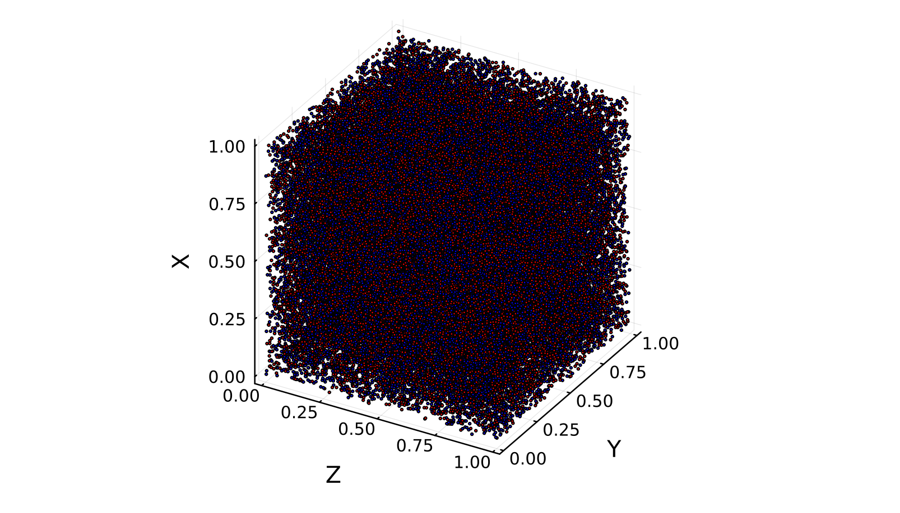
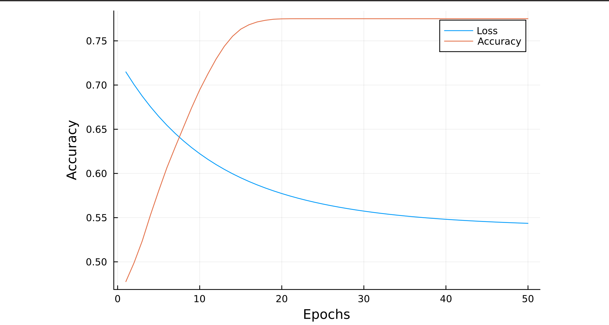

# Machine Learning in Julia for Calorimeter Showers - Evaluation Exercise

## Task 
To train a basic machine learning model in Julia. Using Flux, train a network to distinguish between the labels.

About the dataset :
The dataset consists of 3 coordinate parameters (x, y, z) and a label (s == signal, b == background)

## Getting Started

### Prerequisites and Installation
- Download and install the latest version of [Julia](https://julialang.org)
- Setting up the Julia environment by creating a new project:
  ```
    julia> import Pkg
  ```
  ```
    julia> Pkg.activate(".")
  ```
  ```
    julia> Pkg.instantiate()
  ```
  On activating the enviroment it will start downloading the packages present in the project.toml file.
  
- Install the required packages into your local Julia environment. (You can refer [project.toml]( for the required packages.)
  ```
  julia> Pkg.add("package_name")
  ```

### Running the Code 
To train the machine learning model and evaluate its performance, run the Julia script using the given command 
```
  julia> include("file_name")
```

## About the Model
We use the Flux package to build a simple neural network with three input nodes (representing coordinates 'x', 'y', 'z') and two output nodes for 'signal' and 'background' classes. The model architecture is defined in the flux_model variable.
We build a Binary Classification Model since the output consists of 2 classes only.

### Data Preprocessing
Using CSV and Dataframes, we import the datasset. The dependent variables are in form of String, to convert this data into a form that can be fed to a machine learning model we use onhotencoding technique.
To visualize the data, we use Plots package.

### Loss Function
The Flux package consists of different in-built function to calculate loss. As we are building a binary classification model, we use Flux.binarycrossentropy to calculate loss.

### Accuracy function
We compare the predictions of the model with the actual values and calculate its accuracy.
Since the output is in decimal ranging from 0 to 1, we convert it to binary and then to Int64.

### Training the model
'dLdm' includes both the gradients with respect to the weights and biases, and you use this information to update both sets of parameters during the training process.  

The loop can be adjusted as per the user's needs, and the conditions can be specified in plain Julia. Here we will train the model for a maximum of 50 epochs, but to ensure that the model does not overfit, we will break as soon as our accuracy value crosses or becomes equal to 0.98.
To keep track of loss and accuracy, for each epoch we store it in loss_history and accuracy_history.

## Results

Post-training, the model's accuracy and loss on the test set are computed. 

The trained model shows an accuracy of 0.77.
| Dataset |  Loss and Accuracy graph 
|--------|---------|
||


